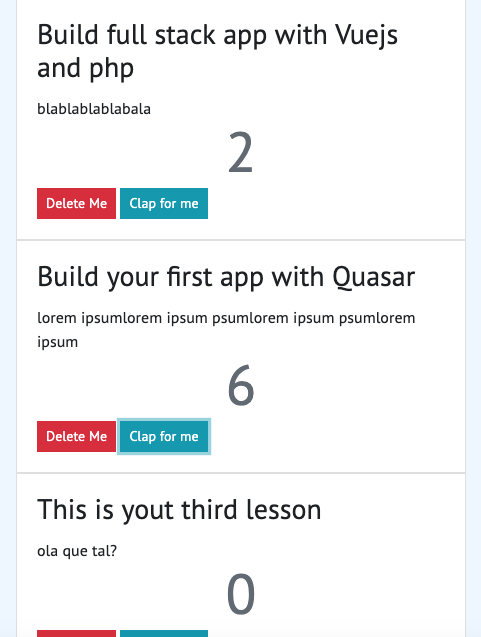

# testComponentsWithVuejs
This is an exemple for understanding how parameters are passed between parents and children throw Components in Vuejs

Inside this mini project, I build a Card Component and passed a parameters to its parents.
I wanted to compare listeners from Vue to Angular (that I used before in my job). 

